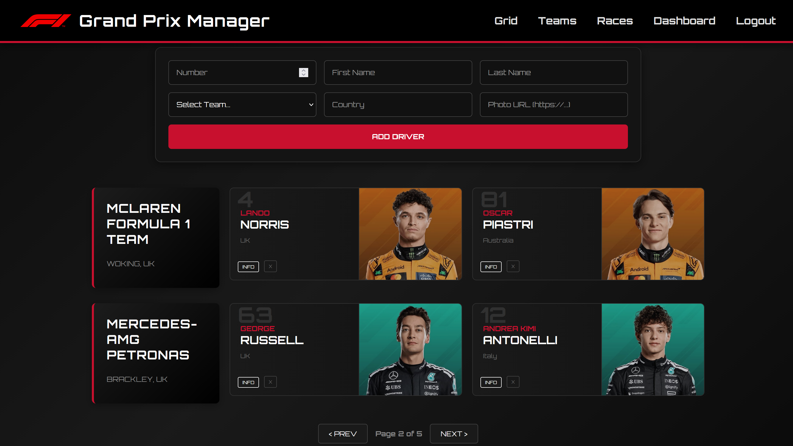

# 🏎️ F1 Grand Prix Manager

A Fullstack Web Application for managing a Formula 1 grid. Built with React, Node.js, Express, and MySQL.

**🔴 Live Demo:** [https://f1-manager-app-3hbn.onrender.com](https://f1-manager-app-3hbn.onrender.com)

---

## 📸 Preview

---

## 🚀 Features

* **View the Grid:** Browse current F1 teams and drivers with a fully responsive, modern UI.
* **Driver Management:** Add, edit, and archive drivers with detailed statistics.
* **Team Management:** View team details, locations, and driver pairings.
* **Admin Dashboard:** Secure authentication and authorization for managing the grid.
* **Responsive Web Design (RWD):** Optimized for desktops, tablets, and mobile devices using CSS Flexbox and Grid.

---

## 🛠️ Tech Stack & Architecture

This project is built using a modern **Three-Tier Architecture**:

### 1. Presentation Tier (Frontend)
* **Technologies:** React, React Router, Custom CSS (Responsive Design).
* **Hosting:** Deployed as a Static Site on **Render**.
* **Role:** Handles user interactions, routing, and displays dynamic data fetched from the REST API.

### 2. Application Tier (Backend)
* **Technologies:** Node.js, Express.js.
* **Hosting:** Deployed as a Web Service on **Render**.
* **Role:** Acts as the bridge between the client and the database. Handles business logic, CORS, routing, and processes API requests.

### 3. Data Tier (Database)
* **Technologies:** MySQL.
* **Hosting:** Cloud Database hosted on **Aiven**.
* **Role:** Securely stores all relational data (teams, drivers, users) and enforces data integrity. Connected to the backend via an SSL-encrypted connection.